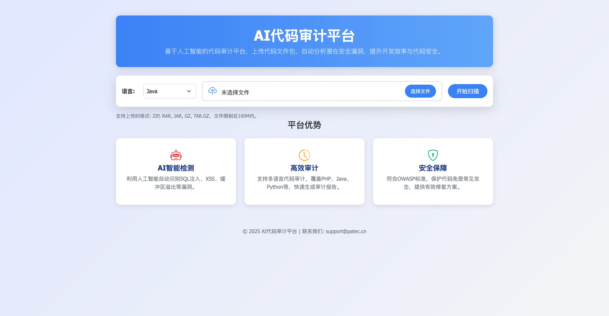
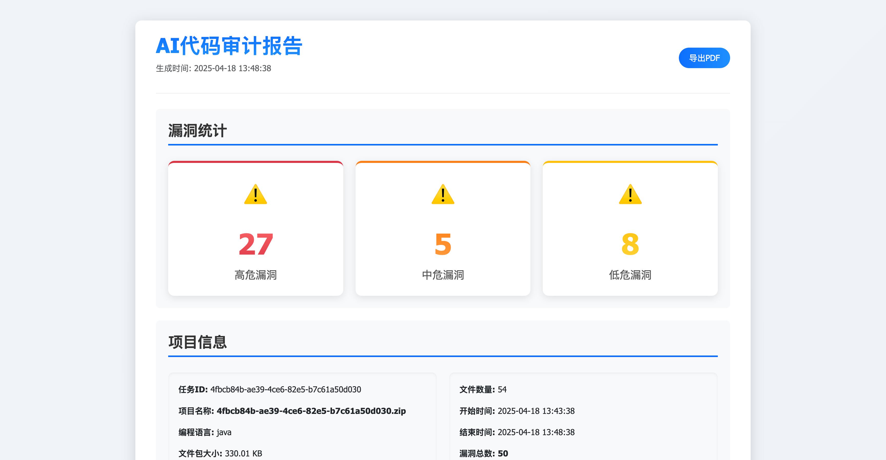

# aicodeaudit
基于AI的代码审计系统




# 代码审计平台

基于 Go 语言开发的代码审计平台，AI 分析扫描结果，生成易于理解的安全漏洞报告。

## 功能特点

- 支持多种编程语言的代码审计（PHP、Java、C#、Go、Ruby、Python、JavaScript、HTML、Rust、C 等）
- 支持多种压缩文件格式（ZIP、RAR、TAR、GZ、7Z 等）
- 使用 AI 进行静态代码分析
- 通过 AI 对扫描结果进行深度分析和解释
- 美观的 Web 界面，展示详细的漏洞报告
- 支持拖放上传文件

## 系统要求

- Go 1.16+
- 解压工具（unzip、unrar、tar、7z）
- OpenAI API 密钥（用于 AI 分析）

## 安装步骤

1. 克隆代码库

```bash
需要py环境，先安装一个扫描引擎 pip install semgrep 后期可进行更新即可
然后go build -o codeaudit main.go 编译一下 配置文件放根目录即可还有rules文件 

#项目结构
/
├── config.yaml           # 配置文件
├── main.go               # 主程序入口
├── go.mod                # Go模块定义
├── go.sum                # 依赖版本锁定
├── static/               # 静态资源
│   ├── css/              # 样式文件
│   ├── js/               # JavaScript文件
│   └── img/              # 图片资源
├── templates/            # HTML模板
│   ├── index.html        # 首页模板
│   └── report.html       # 报告页面模板
├── upload/               # 上传文件存储目录
├── extracted/            # 解压文件存储目录
├── reports/              # 报告存储目录
└── pkg/                  # 包目录
    ├── config/           # 配置相关
    ├── handler/          # HTTP处理器
    ├── model/            # 数据模型
    └── service/          # 业务逻辑
        ├── scanner/      # 扫描服务
        ├── analyzer/     # AI分析服务
        └── extractor/    # 文件解压服务
